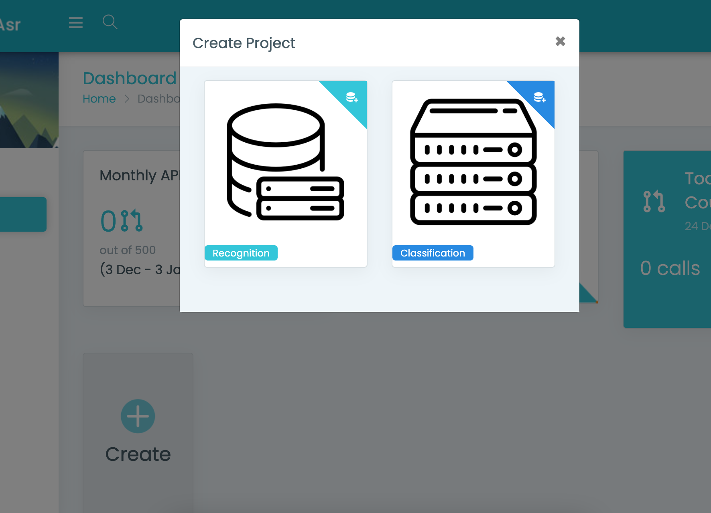
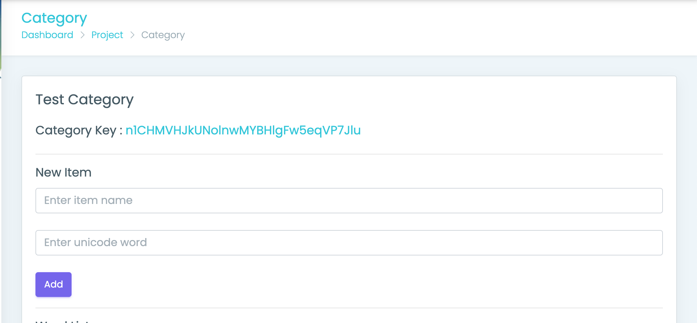

# Bagan Automatic Speech Recognition SDK for Android

Add a myanmar language speech recognition system to your application. With no or minimal changes to the existing UI.

## How to start

To bring voice control to an Android application:

1. [Sign up for Bagan ASR Console](https://cms.baganasr.com/)
2. Create Project 
 

    You can create two type of project (Recognition and Classification).
    For classification we need to add categories and  items. 

3. Add a reference as a Maven dependency
    Do the following:
    Open the build.gradle file at the project level.
    In repositories block, add maven { url 'https://jitpack.io' } .
    ```gradle
    allprojects {
        repositories {
            google()
            jcenter()
            maven { url 'https://jitpack.io' }  // add this line
        }
    }
    ```

    Open the build.gradle file at the module level.
    In the dependencies block, add the dependency configuration for the Bagan ASR Android SDK.

    ```gradle
        dependencies {
            implementation 'com.github.baganinnotech:internal-bagan-asr-sdk-android:1.0.2'
        }
    ```

4. Add AsrButton in your layout file.
    ```xml
        <com.bit.asrsdk.AsrButton
                android:id="@+id/asrbutton"
                android:layout_width="wrap_content"
                android:layout_height="wrap_content"
                android:layout_margin="@dimen/fab_margin"
                app:srcCompat="@drawable/active_mic"
                tools:ignore="VectorDrawableCompat"
                android:layout_gravity="bottom|end"
                android:clickable="false" />
    ```
5. The following is the example code to use asr sdk.
    ```java
        ConfigSdk config = ConfigSdk.Builder.newInstance()
                    .setProjectId("YOUR_PROJECT_ID_HERE")
                    .build();
        config.init(getApplicationContext());


        AsrButton asrButton = (AsrButton) findViewById(R.id.asrbutton);
        asrButton.setOnClickListener(new View.OnClickListener() {
            @Override
            public void onClick(View v) {
                Intent intent = new Intent(getApplicationContext(), AudioActivity.class);
                startActivityForResult(intent, ASRConstant.VOICE_REQUEST_CODE);
            }
        });

        @Override
    protected void onActivityResult(int requestCode, int resultCode, @Nullable Intent data) {
        super.onActivityResult(requestCode, resultCode, data);
        if (requestCode == ASRConstant.VOICE_REQUEST_CODE) {
            String result = "";
            try {
                result = data.getStringExtra(ASRConstant.VOICE_REQUEST_DATA);
            } catch (Exception e) {
                e.printStackTrace();
            }
            try {
                JSONObject resultJsonObject = new JSONObject(result);
                Log.e("ASR", "Result Value : " + resultJsonObject.toString());
                 info.setText(resultJsonObject.getString("text")+ "");
            } catch (JSONException e) {
                e.printStackTrace();
            }

        }
    }
    ```
6. For classification project. Do the following:
    Create category in web console.
    Add item in that category.
    Copy category id from web console.
    

    Add category id in your code.
    ```java
         ConfigSdk config = ConfigSdk.Builder.newInstance()
                    .setProjectId("YOUR_PROJECT_ID_HERE")
                    .setCategoryId("YOUR_CATEGORY_ID_HERE")
                    .build();

    ```
    
7. Add activity declaration in your Android Manifest .
```xml
        <activity android:name="com.bit.asrsdk.AudioActivity"
            android:theme="@style/AppTheme.NoActionBar">
        </activity>
```


## Example  app

You can download and build this repository for example app

or [Download apk](https://github.com/baganinnotech/bagan-asr-sdk-android/releases/download/v1.0/app-release.apk)

## Have questions?
If you have any questions or if something is missing in the documentation, please [contact us](mailto:baganinnotech@gmail.com). We love hearing from you!)
